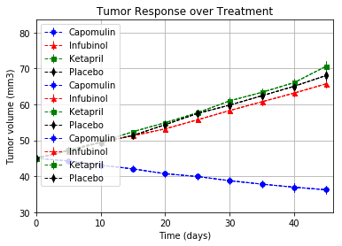
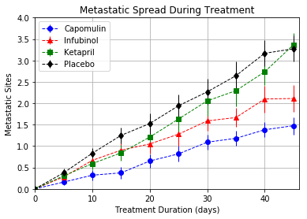
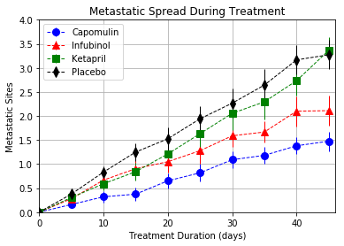
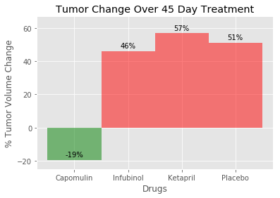

# Pymaceuticals specializes in drug-based, anti-cancer pharmaceuticals. In their most recent efforts, 
# they've since begun screening for potential treatments to squamous cell carcinoma (SCC), a commonly 
# occurring form of skin cancer.ceuticals specializes in drug-based, anti-cancer pharmaceuticals. 
# In their most recent efforts, they've since begun screening for potential treatments to squamous cell 
# carcinoma (SCC), a commonly occurring form of skin cancer.

```python
# Import Dependencies 
# Numpy for calculations and matplotlib for charting

import numpy as np
import matplotlib.pyplot as plt
import pandas as pd
import os
from scipy.stats import sem

```


```python
# CSV files to load
clinical_csv = os.path.join('raw_data', 'clinicaltrial_data.csv')
mouse_csv = os.path.join('raw_data', 'mouse_drug_data.csv')

# Read the data files into pandas
clinical_df = pd.read_csv(clinical_csv)
mouse_df = pd.read_csv(mouse_csv)

```


```python
clinical_df.count()
```


    Mouse ID              1893
    Timepoint             1893
    Tumor Volume (mm3)    1893
    Metastatic Sites      1893
    dtype: int64


```python
# Drop duplicate rows in clinical_df except for the first ocurrence.

new_clinical_df=clinical_df.drop_duplicates(keep="first")
```


```python
new_clinical_df.count()
```


    Mouse ID              1892
    Timepoint             1892
    Tumor Volume (mm3)    1892
    Metastatic Sites      1892
    dtype: int64


```python
# Merge the data into a single dataset.

total_data=pd.merge(new_clinical_df, mouse_df, how='inner',on='Mouse ID')

```


```python
total_data.columns
```


    Index(['Mouse ID', 'Timepoint', 'Tumor Volume (mm3)', 'Metastatic Sites',
           'Drug'],
          dtype='object')


```python
total_data.head()
```


<div>
<style>
    .dataframe thead tr:only-child th {
        text-align: right;
    }

    .dataframe thead th {
        text-align: left;
    }

    .dataframe tbody tr th {
        vertical-align: top;
    }
</style>
<table border="1" class="dataframe">
  <thead>
    <tr style="text-align: right;">
      <th></th>
      <th>Mouse ID</th>
      <th>Timepoint</th>
      <th>Tumor Volume (mm3)</th>
      <th>Metastatic Sites</th>
      <th>Drug</th>
    </tr>
  </thead>
  <tbody>
    <tr>
      <th>0</th>
      <td>b128</td>
      <td>0</td>
      <td>45.000000</td>
      <td>0</td>
      <td>Capomulin</td>
    </tr>
    <tr>
      <th>1</th>
      <td>b128</td>
      <td>5</td>
      <td>45.651331</td>
      <td>0</td>
      <td>Capomulin</td>
    </tr>
    <tr>
      <th>2</th>
      <td>b128</td>
      <td>10</td>
      <td>43.270852</td>
      <td>0</td>
      <td>Capomulin</td>
    </tr>
    <tr>
      <th>3</th>
      <td>b128</td>
      <td>15</td>
      <td>43.784893</td>
      <td>0</td>
      <td>Capomulin</td>
    </tr>
    <tr>
      <th>4</th>
      <td>b128</td>
      <td>20</td>
      <td>42.731552</td>
      <td>0</td>
      <td>Capomulin</td>
    </tr>
  </tbody>
</table>
</div>


```python
# Create a compound index

total_data_df = total_data.set_index(["Mouse ID","Timepoint"])   # , "Tumor Volume" need 3 columns to make a unique index
```


```python
#########################################################################################################
# PART I .- Create a scatter plot that shows how the tumor volume changes over time for each treatment.
#
# Analyze the data to show how four treatments (Capomulin, Infubinol, Ketapril, and Placebo) compare.
#
#########################################################################################################
```


```python
# Grab DataFrame rows where column has certain values

drugs = ["Capomulin", "Infubinol", "Ketapril","Placebo" ]
drugs_df = total_data[total_data.Drug.isin(drugs)]
drugs_df.head()
```


<div>
<style>
    .dataframe thead tr:only-child th {
        text-align: right;
    }

    .dataframe thead th {
        text-align: left;
    }

    .dataframe tbody tr th {
        vertical-align: top;
    }
</style>
<table border="1" class="dataframe">
  <thead>
    <tr style="text-align: right;">
      <th></th>
      <th>Mouse ID</th>
      <th>Timepoint</th>
      <th>Tumor Volume (mm3)</th>
      <th>Metastatic Sites</th>
      <th>Drug</th>
    </tr>
  </thead>
  <tbody>
    <tr>
      <th>0</th>
      <td>b128</td>
      <td>0</td>
      <td>45.000000</td>
      <td>0</td>
      <td>Capomulin</td>
    </tr>
    <tr>
      <th>1</th>
      <td>b128</td>
      <td>5</td>
      <td>45.651331</td>
      <td>0</td>
      <td>Capomulin</td>
    </tr>
    <tr>
      <th>2</th>
      <td>b128</td>
      <td>10</td>
      <td>43.270852</td>
      <td>0</td>
      <td>Capomulin</td>
    </tr>
    <tr>
      <th>3</th>
      <td>b128</td>
      <td>15</td>
      <td>43.784893</td>
      <td>0</td>
      <td>Capomulin</td>
    </tr>
    <tr>
      <th>4</th>
      <td>b128</td>
      <td>20</td>
      <td>42.731552</td>
      <td>0</td>
      <td>Capomulin</td>
    </tr>
  </tbody>
</table>
</div>


```python
# Pivot Table for average 
tumor_change_mean = drugs_df.pivot_table(index=['Timepoint'], columns=['Drug'], values='Tumor Volume (mm3)', aggfunc=np.mean)

print (tumor_change_mean)
tumor_change_mean.columns
```

    Drug       Capomulin  Infubinol   Ketapril    Placebo
    Timepoint                                            
    0          45.000000  45.000000  45.000000  45.000000
    5          44.266086  47.062001  47.389175  47.125589
    10         43.084291  49.403909  49.582269  49.423329
    15         42.064317  51.296397  52.399974  51.359742
    20         40.716325  53.197691  54.920935  54.364417
    25         39.939528  55.715252  57.678982  57.482574
    30         38.769339  58.299397  60.994507  59.809063
    35         37.816839  60.742461  63.371686  62.420615
    40         36.958001  63.162824  66.068580  65.052675
    45         36.236114  65.755562  70.662958  68.084082
    


    Index(['Capomulin', 'Infubinol', 'Ketapril', 'Placebo'], dtype='object', name='Drug')


```python
# Pivot Table for standard error 
tumor_change_sem = drugs_df.pivot_table(index=['Timepoint'], columns=['Drug'], values='Tumor Volume (mm3)', aggfunc=sem)

print (tumor_change_sem)
```

    Drug       Capomulin  Infubinol  Ketapril   Placebo
    Timepoint                                          
    0           0.000000   0.000000  0.000000  0.000000
    5           0.448593   0.235102  0.264819  0.218091
    10          0.702684   0.282346  0.357421  0.402064
    15          0.838617   0.357705  0.580268  0.614461
    20          0.909731   0.476210  0.726484  0.839609
    25          0.881642   0.550315  0.755413  1.034872
    30          0.934460   0.631061  0.934121  1.218231
    35          1.052241   0.984155  1.127867  1.287481
    40          1.223608   1.055220  1.158449  1.370634
    45          1.223977   1.144427  1.453186  1.351726
    


```python
# Generate the Plot 

plt.title("Tumor Response over Treatment")
plt.xlabel("Time (days)")
plt.ylabel("Tumor volume (mm3)")
plt.grid(True)
plt.figsize=(10, 5)

plt.xlim(0,drugs_df['Timepoint'].max()+1)

plt.ylim(30,drugs_df['Tumor Volume (mm3)'].max()+5)

#Plotting graphs (with error bars)
plt.errorbar(tumor_change_mean.index, tumor_change_mean.loc[:,'Capomulin'], yerr= tumor_change_sem.loc[:,'Capomulin'],
             marker="o", markersize= 5, linestyle='dashed', linewidth=1, color="b")
plt.errorbar(tumor_change_mean.index, tumor_change_mean.loc[:,'Infubinol'], yerr= tumor_change_sem.loc[:,'Infubinol'],
             marker="^", markersize= 5, linestyle='dashed', linewidth=1, color="r")
plt.errorbar(tumor_change_mean.index, tumor_change_mean.loc[:,'Ketapril'], yerr= tumor_change_sem.loc[:,'Ketapril'],
             marker="s", markersize= 5, linestyle='dashed', linewidth=1, color="g")
plt.errorbar(tumor_change_mean.index, tumor_change_mean.loc[:,'Placebo'], yerr= tumor_change_sem.loc[:,'Placebo'],
             marker="d", markersize= 5, linestyle='dashed', linewidth=1, color="k")

# Include a legend in best location
plt.legend(loc="best", fancybox=True)

# Save the figure
plt.savefig('charts/PyMaceutical_fig1.png')

# Show the figure
plt.show()

```





```python
#########################################################################################################
# PART II .- Create a scatter plot that shows how the number of metastatic (cancer spreading) sites 
#           changes over time for each treatment.
#
# Analyze the data to show how four treatments (Capomulin, Infubinol, Ketapril, and Placebo) compare.
#
#########################################################################################################

```


```python
# Pivot Table for average 
metastatic_mean = drugs_df.pivot_table(index=['Timepoint'], columns=['Drug'], values='Metastatic Sites', aggfunc=np.mean)


# Pivot Table for standard error 
metastatic_sem = drugs_df.pivot_table(index=['Timepoint'], columns=['Drug'], values='Metastatic Sites', aggfunc=sem)

```


```python
# Generate the Plot 

plt.title("Metastatic Spread During Treatment")
plt.xlabel("Treatment Duration (days)")
plt.ylabel("Metastatic Sites")
plt.grid(True)

# Getting the limits
plt.xlim(0,drugs_df['Timepoint'].max()+1)
plt.ylim(0,drugs_df['Metastatic Sites'].max())

#Plotting graphs (with error bars)
plt.errorbar(metastatic_mean.index, metastatic_mean.loc[:,'Capomulin'], yerr= metastatic_sem.loc[:,'Capomulin'],
             marker="o", linestyle='dashed', linewidth=1, color="b")
plt.errorbar(metastatic_mean.index, metastatic_mean.loc[:,'Infubinol'], yerr= metastatic_sem.loc[:,'Infubinol'],
             marker="^", linestyle='dashed', linewidth=1, color="r")
plt.errorbar(metastatic_mean.index, metastatic_mean.loc[:,'Ketapril'], yerr= metastatic_sem.loc[:,'Ketapril'],
             marker="s", linestyle='dashed', linewidth=1, color="g")
plt.errorbar(metastatic_mean.index, metastatic_mean.loc[:,'Placebo'], yerr= metastatic_sem.loc[:,'Placebo'],
             marker="d", linestyle='dashed', linewidth=1, color="k")

# Include a legend in best location
plt.legend(loc="best", fancybox=True)

# Save the figure
plt.savefig('charts/PyMaceutical_fig2.png')

# Show the figure
plt.show()
```





```python
###################################################################################################################
# PART III .- Create a scatter plot that shows the number of mice still alive through the course of treatment 
#             (Survival Rate).
#
# Analyze the data to show how four treatments (Capomulin, Infubinol, Ketapril, and Placebo) compare.
#
####################################################################################################################
```


```python
# Generate the Plot 

plt.style.use('ggplot')
plt.figsize=(15, 12)
plt.title("Survival During Treatment")
plt.xlabel("Treatment Duration (days)")
plt.ylabel("Survival Rate %")
plt.grid(True)

x =[0,5,10,15,20,25,30,35,40,45]

# Count how many times each mice appears in our group

drugs={}

for d in drugs_df.Drug.unique():
    drugs[d] = drugs_df.loc[drugs_df['Drug']==d,:]
    
    # Calculate the Percentage of mice alive
    survival_rate = drugs[d].groupby(['Drug','Timepoint'])['Tumor Volume (mm3)'].count()
    survival_rate = 100 *survival_rate /25
    
    # Plotting the Survival Rate for each Treatment
    plt.scatter(x, survival_rate, label=d, alpha=0.6,linestyle='dashed', linewidth=2 )
      
# Include a legend in best location
plt.legend(loc="best", fancybox=True)

# Save the figure
plt.savefig('charts/PyMaceutical_fig3.png')

# Show the figure
plt.show()
```





```python
###################################################################################################################
# PART IV .- Creating a bar graph that compares the total % tumor volume change for each drug across the full 45 days.            
# (Survival Rate).
#
# Analyze the data to show how four treatments (Capomulin, Infubinol, Ketapril, and Placebo) compare.
#
# Your bar graph should indicate tumor growth as red and tumor reduction as green. It should also include a label with the 
#  percentage change for each bar. 
#
####################################################################################################################
```


    <bound method NDFrame.describe of Drug
    Capomulin   -19.475303
    Infubinol    46.123472
    Ketapril     57.028795
    Placebo      51.297960
    dtype: float64>


```python
# Take the pivot table information of part I and calculate the percentage change for each drug
 
tumor_percentage_df = ((tumor_change_mean.iloc[-1] - tumor_change_mean.iloc[0])/tumor_change_mean.iloc[0])*100
drugs = ["Capomulin", "Infubinol", "Ketapril", "Placebo"]

# Plot the results, splitting the data between passing and failing drugs
fig, ax =plt.subplots()

# Set x values
x_values = np.arange(len(tumor_percentage_df))

tumor_red_Pass = ax.bar(x_values[0], tumor_percentage_df[0], 1, color='green', alpha=0.5 )
tumor_red_Fail = ax.bar(x_values[1:], tumor_percentage_df[1:], 1, color='red', alpha=0.5 )

ax.set_title("Tumor Change Over 45 Day Treatment")
ax.set_xlabel("Drugs")
ax.set_ylabel("% Tumor Volume Change")

tick_locations = [value for value in x_values]
ax.set_xticks(tick_locations)
ax.set_xticklabels(("Capomulin", "Infubinol", "Ketapril", "Placebo"))
ax.grid(True)

ax.set_ylim(-25, tumor_percentage_df[1:].max()+10 )

# Use autolabel function to label the percentages of changes

def autolabel(rects, ax):
    
    # Get y-axis height to calculate label position from.
    (y_bottom, y_top) = ax.get_ylim()
    y_height = y_top - y_bottom

    for rect in rects:
        height = rect.get_height()
        
        # Fraction of axis height taken up by this rectangle
        p_height = (height / y_height)

        # If we can fit the label above the column, do that;
        # otherwise, put it inside the column.
        
        if p_height > 0.90: 
            label_position = height - (y_height * 0.05)
        else:
            label_position = height + (y_height * 0.01)
        ax.text(rect.get_x() + rect.get_width()/2., label_position,'%d%%' % int(height), ha='center', va='bottom', color='black')

# Call functions to implement the function calls

autolabel(tumor_red_Pass, ax)
autolabel(tumor_red_Fail, ax)

# Include a legend in best location
plt.legend(loc="best", fancybox=True)

# Save the figure
plt.savefig('charts/PyMaceutical_fig4.png')

# Show the figure
plt.show()
```




