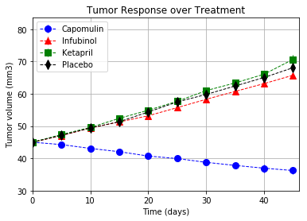
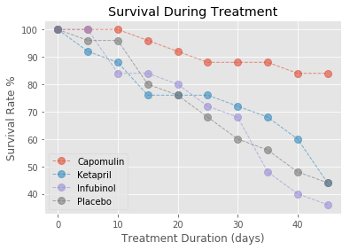
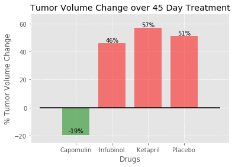

# PyMaceutical HW

Date: 12/16/17

The objective of this homework is to analyze the data to show how four treatments (Capomulin, Infubinol, Ketapril, and Placebo) compare. The following tasks are required:

1) Create a scatter plot that shows how the tumor volume changes over time for each treatment.
2) Create a scatter plot that shows how the number of metastatic (cancer spreading) sites changes over time for each treatment.
3) Create a scatter plot that shows the number of mice still alive through the course of treatment (Survival Rate).
4) Creating a bar graph that compares the total % tumor volume change for each drug across the full 45 days.      

## 1) Create a scatter plot that shows how the tumor volume changes over time for each treatment.

### Conclusions: "Tumor Response over Time"  ( PyMaceutical_fig1.png )

Notice the decrease in tumor volume change over the 45 days treatment for the mice that were treated with Capomulin. On other hand, the other two drugs were unsuccessful; been Ketrapril drug performed worst than a Placebo.

## 2) Create a scatter plot that shows how the number of metastatic (cancer spreading) sites changes over time for each treatment.

### Conclusions: "Metastatic Spread During Treatment"  ( PyMaceutical_fig2.png )

In this chart, The drugs Ketapril and Placebo caused high risk of metastatic spread during the 45 days treatment. The best medication was Capomulin having lower risk, and the next one was Infubinol.

## 3) Create a scatter plot that shows the number of mice still alive through the course of treatment (Survival Rate).

### Conclusions: "Survival During Treatment"  ( PyMaceutical_fig3.png )

The survival rate for mice treated with Capomulin was above 80% over 45 days of treatment, by contrast, the infunibol drug was not effective because the percentage of survival rate was below 50% after 30 days. The company should think to stop producing it.

## 4) Creating a bar graph that compares the total % tumor volume change for each drug across the full 45 days.            

### Conclusions: "Tumor Volume Change Over 45 Day Treatment"  ( PyMaceutical_fig4.png )

The  % of Tumor Change over the  45 day  treatment was above of 50% for Ketapril and Placebo, that means the tumor kept growing not matter if the mice was taking medication. The best drug over all was Capomulin; it performed really good because stop the increase of Tumor.    

